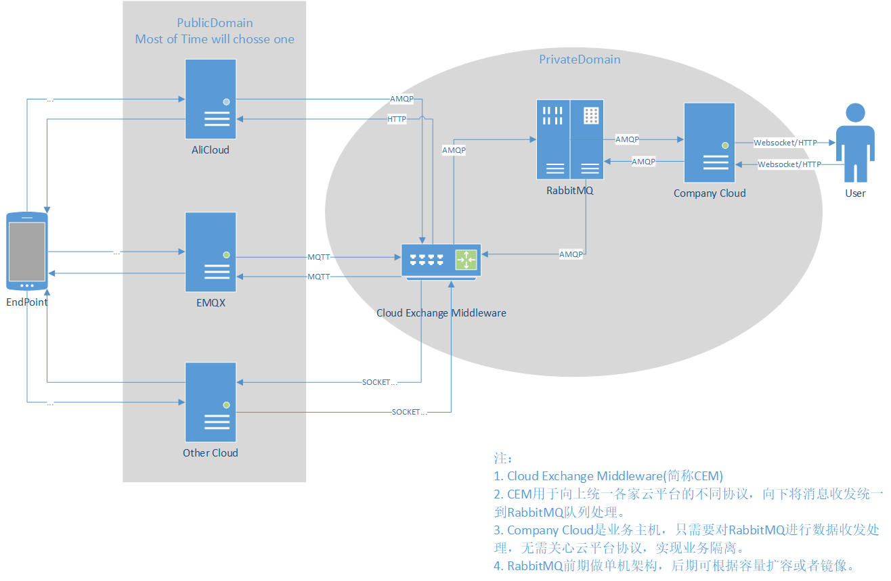

# CEM

CEM全称Cloud Exchange Middleware

这是一款**实验性**的网络中间件服务，它用于解决实际业务中设备云与管理云业务隔离的诸多问题。

待解决核心问题：

- 业务中存在多设备同时上报，容易堵塞处理服务
- 业务中存在多个云平台同时接入，需要做统一管理和收发
- 业务隔离需要实现内部统一数据格式
- 单体服务的臃肿性和维护困难
- 不同开发团队的隔离统一

设计考虑因素：

- 本系统仅是服务转发和管理的中间件，并非整体系统
- 本系统意在实现微服务架构，明晰整体系统
- 设计同时允许的设备数据量为千级到万级，满足中小公司的设备需求
- 设计服务流转的内部统一数据格式，需要满足多种语言共用
- 需要多并发满足峰值设备数据处理

设计理念：

- 使用GoLang语言开发
- 使用RabbitMQ作为数据流转核心，实现流量削峰和队列分发
- 使用ProtoBuf作为统一数据流转格式

整体架构草图如下

### LICENSE:

Apache2.0